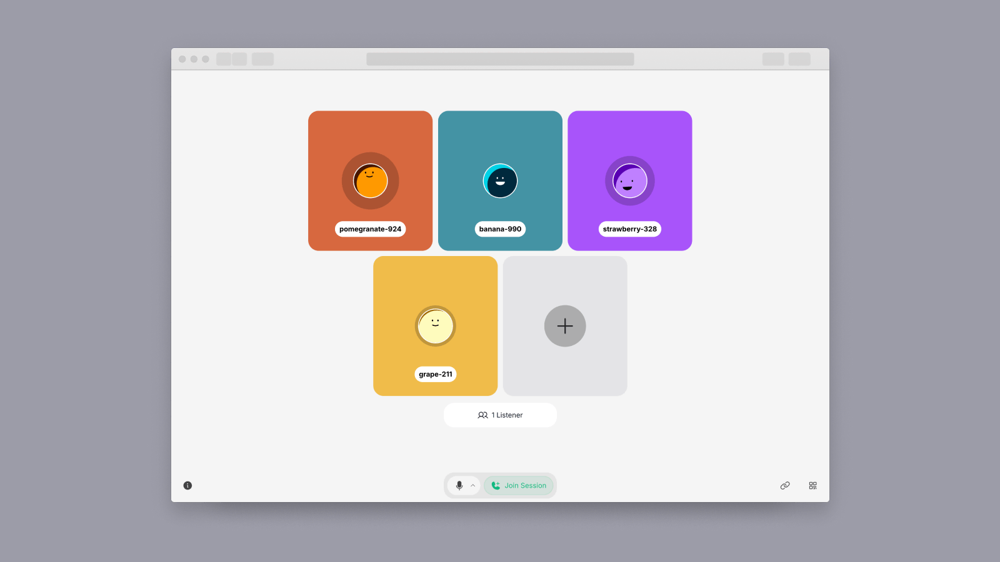

# Amazon IVS Real-time Audio Rooms Web Demo

A demo web application intended as an educational tool to demonstrate how you can build a browser-based real-time audio only streaming app with the [Amazon IVS Real-time Web Broadcast SDK](https://aws.github.io/amazon-ivs-web-broadcast/docs/real-time-sdk-guides/introduction).



<br/>

**This project is intended for education purposes only and not for production usage.**

## 🔗 Quick links

- [Deploying the application to AWS](#deploying-the-application-to-aws)
  - [Prerequisites](#prerequisites)
  - [Initialization](#initialization)
  - [Deploy the backend](#deploy-the-backend)
  - [Deploy the website](#deploy-the-website)
- [Running the application locally](#running-the-application-locally)
- [Managing the key-pair for participant stage tokens](#managing-the-key-pair-for-participant-stage-tokens)
- [Teardown and clean-up](#teardown-and-clean-up)
- [Known issues and limitations](#known-issues-and-limitations)
- [About Amazon IVS](#about-amazon-ivs)
- [Security](#security)
- [License](#license)

## Deploying the application to AWS

_IMPORTANT NOTE: Deploying this demo application in your AWS account will create and consume AWS resources, which will cost money._

### Prerequisites

Before continuing, ensure you have installed the following tools:

- [AWS CLI Version 2](https://docs.aws.amazon.com/cli/latest/userguide/install-cliv2.html)
- [NodeJS](https://nodejs.org/en/) v20 and `npm` (npm is usually installed with NodeJS)
  - If you have [node version manager](https://github.com/nvm-sh/nvm) installed, run `nvm use` to sync your node version with this project

For configuration specifics, refer to the [AWS CLI User Guide](https://docs.aws.amazon.com/cli/latest/userguide/cli-chap-configure.html).

### Initialization

Before deploying the backend and website CloudFormation stacks to your AWS account, you need to initialize the application for deployment. This process involves installing dependencies and creating a CDK bootstrap stack. Follow these steps:

**Install dependencies and bootstrap:**

```bash
npm run deploy:init
```

This command installs the `infra` dependencies and creates a CDK bootstrap stack in your default AWS region if it doesn't already exist.

**Additional notes**

- These initialization steps only need to be completed once per AWS account.
- If you're deploying to multiple regions, make sure to bootstrap each region you'll be using.
- If you encounter any permission-related errors during bootstrapping, ensure that your AWS credentials have the necessary permissions to create resources in the respective regions.

After completing these initialization steps, your AWS environment will be prepared for deploying the application stacks. You can proceed with the actual deployment process as outlined in the subsequent sections of this README.

### Deploy the backend

After completing all deployment prerequisites, you're ready to deploy the backend stack. This step is crucial whether you plan to run the application locally or deploy it through the website stack. The backend stack creates several essential resources in your AWS account:

- API Gateway REST API (`RoomAPI`)
- DynamoDB Table (for room data storage)
- Lambda functions
- SQS FIFO queue
- KMS symmetric key
- SSM parameter (for public key ARN storage)
- Secrets Manager secret value (for private key storage)
- Multiple EventBridge Rules (scheduled and event-driven)

To deploy the backend stack, use the command corresponding to your desired application environment:

| **Environment** | **Command**                   |
| --------------- | ----------------------------- |
| development     | `npm run deploy:backend:dev`  |
| production      | `npm run deploy:backend:prod` |

**Additional notes**

- For local application development, deploy to the `development` environment.
- The stack outputs, including API endpoints and other configuration details, are automatically retrieved when running the app locally. This is done using the CloudFormation SDK when starting the development server.
- No additional frontend configuration is required after deployment, as the necessary information is fetched dynamically.

### Deploy the website

**Note**: if you only intend to run the application locally and do not plan to host it, you can skip this section and proceed directly to the [Running the Application Locally](#running-the-application-locally) section.

**Prerequisite**: you must have successfully deployed the backend stack before proceeding with the website deployment.

Once the backend stack is in place, you're ready to deploy the website stack. This stack creates a CloudFront distribution to serve a static Single Page Application (SPA) hosted on Amazon S3.

The application bundle is deployed to a CloudFront distribution, served exclusively from the public CloudFront distribution domain without the use of a custom domain.

To deploy the website stack, use the command corresponding to your desired application environment:

| **Environment** | **Command**                   |
| --------------- | ----------------------------- |
| development     | `npm run deploy:website:dev`  |
| production      | `npm run deploy:website:prod` |

**Additional notes**

- The website deployment process automatically bundles and optimizes your frontend application prior to deployment.
- After deployment, CDK will output the URL where your application is accessible.
- Remember that the website stack depends on the backend stack, so any major changes to the backend might require a redeployment of the website stack as well.

## Running the Application Locally

Before running the application locally, ensure that you have completed the following prerequisite:

**Prerequisite**: [Deploy the backend stack](#deploy-the-backend) to the `development` environment.

Once you have the backend infrastructure in place, you can run the application on your local machine for development and testing purposes. This process will start a development server that connects to the deployed backend resources.

To run the application locally, run the following command:

```bash
npm run dev
```

This command does the following:

- Retrieves the necessary configuration from the CloudFormation stack outputs of the backend stack deployed to the `development` environment
- Sets up the development environment with the correct API endpoints, user pool details, and other required configurations
- Starts the development server, typically on `http://localhost:3000` (unless configured otherwise)

## Managing the key-pair for participant stage tokens

This demo application uses a public/private key-pair to create and verify participant stage tokens.

- The application generates an ECDSA public/private key pair
- The private key is used to sign JSON Web Tokens (JWTs) on the server
- The public key is imported to Amazon IVS for token verification during stage join
- For more details, see the [Amazon IVS documentation on distributing tokens](https://docs.aws.amazon.com/ivs/latest/RealTimeUserGuide/getting-started-distribute-tokens.html)

While the initial key-pair is created automatically when deploying the backend stack, you may need to rotate these keys periodically or immediately if you suspect the private key has been compromised.

To manually rotate the key-pair, run the following command:

```bash
npm run rotateKeyPair -- --appEnv {APP_ENV}
```

Replace `{APP_ENV}` with the environment of your deployed backend stack (e.g. `development` or `production`).

When you run the key rotation command:

1. A new ECDSA public/private key pair is generated
2. The new public key is imported to IVS
3. The old public key is deleted from IVS
4. The new private key replaces the old one in AWS Secrets Manager
5. The new public key ARN is updated in AWS Systems Manager Parameter Store

## Teardown and clean-up

When you're finished with your deployment or want to remove all created resources, you should tear down the stacks to avoid unexpected charges to your AWS account. This process involves destroying both the backend and website stacks, followed by some manual clean-up steps.

### Destroying the Stacks

1. **Destroy the Website Stack**

   To tear down the website stack, use the following command:

   ```bash
   APP_ENV={APP_ENV} npm run destroy:website
   ```

   Replace `{APP_ENV}` with the appropriate environment (e.g., `development` or `production`).

2. **Destroy the Backend Stack**

   After the website stack is destroyed, tear down the backend stack using this command:

   ```bash
   APP_ENV={APP_ENV} npm run destroy:backend
   ```

   Again, replace `{APP_ENV}` with the appropriate environment.

### Manual Clean-up Steps

After destroying the stacks, some resources may still remain and need manual cleanup. These resources don't incur charges when inactive but should be removed for completeness:

- **IVS Stages**
- **IVS Imported Public Keys**

To perform these clean-up steps:

1. Log in to the AWS Management Console
2. Navigate to the Amazon IVS service
3. Check for and delete any remaining Stages and imported public keys associated with your application

## Known issues and limitations

- The application is meant for demonstration purposes and **not** for production use.
- This application is only tested and supported on the latest Desktop version of Chrome. Other browsers and devices, including mobile browsers and smartphones, may work with this tool, but are not officially supported at this time.
- Sessions will be automatically deleted six hours after creation in development mode and one hour after creation in production mode. Users will be automatically removed from the session when it is deleted.

## About Amazon IVS

Amazon Interactive Video Service (Amazon IVS) is a managed live streaming and stream chat solution that is quick and easy to set up, and ideal for creating interactive video experiences. [Learn more](https://aws.amazon.com/ivs/).

- [Amazon IVS docs](https://docs.aws.amazon.com/ivs/)
- [User Guide](https://docs.aws.amazon.com/ivs/latest/userguide/)
- [API Reference](https://docs.aws.amazon.com/ivs/latest/APIReference/)
- [Setting Up for Streaming with Amazon Interactive Video Service](https://aws.amazon.com/blogs/media/setting-up-for-streaming-with-amazon-ivs/)
- [Learn more about Amazon IVS on IVS.rocks](https://ivs.rocks/)
- [View more demos like this](https://ivs.rocks/examples)

## Security

See [CONTRIBUTING](CONTRIBUTING.md#security-issue-notifications) for more information.

## License

This library is licensed under the MIT-0 License. See the LICENSE file.
